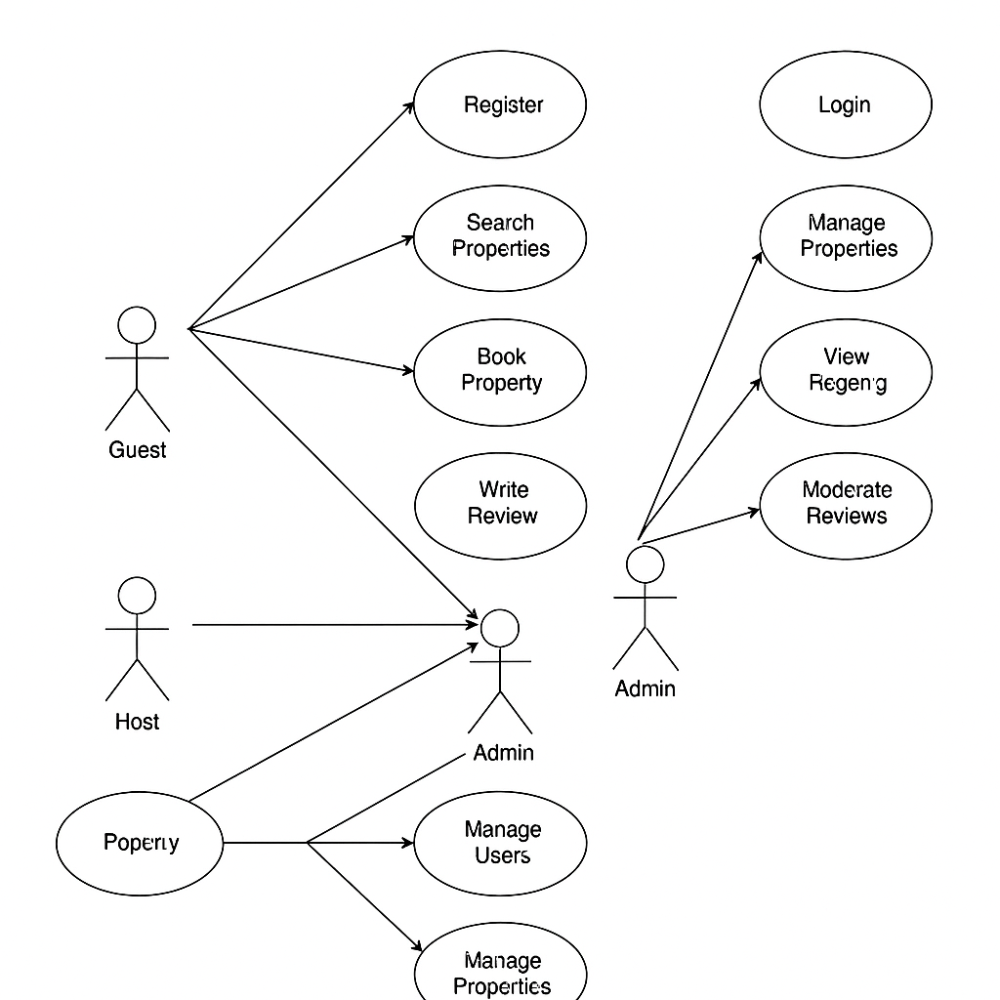

# Use Case Diagram – Airbnb Clone Backend

This directory contains the **Use Case Diagram** that visualizes system interactions for the backend of the Airbnb Clone project.

## 📌 Objective

To illustrate how different types of users (Guests, Hosts, Admins) interact with the backend system for core functionalities such as:

- User registration and login
- Property creation and management
- Booking and payment processes
- Review system
- Messaging between users

## 👥 Actors

- **Guest**: A user who books properties.
- **Host**: A user who lists and manages properties.
- **Admin**: A user with elevated permissions for managing the platform.

## 🧩 Key Use Cases

- **Register/Login** (Guest, Host)
- **View Properties** (Guest)
- **Create/Edit/Delete Property** (Host)
- **Book Property** (Guest)
- **Make Payment** (Guest)
- **Leave Review** (Guest)
- **Send Message** (Guest/Host)
- **Manage Users/Bookings** (Admin)

## 🖼️ Use Case Diagram

